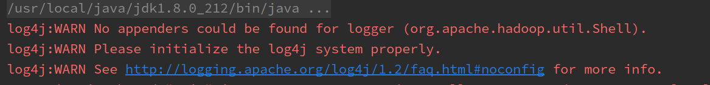

1. 初始化仓库

2. 新建 `aloha/src/hadoop/rpc` 包， 编写 hadoop rpc 调用的例子

3. 警告：

   

   原因： log4j 没有正确配置， 需要在类路径下加入配置文件 log4j.properties 或 log4j.xml

   解决：

   在 `src` 下新建 log4j.properties

   ```properties
   # 可选值： INFO, ERROR, WARNING, FATAL, DEBUG
   log4j.rootLogger=DEBUG, CA
   log4j.appender.CA=org.apache.log4j.ConsoleAppender
   log4j.appender.CA.layout=org.apache.log4j.PatternLayout
   log4j.appender.CA.layout.ConversionPattern=%-4r [%t] %-5p %c %x - %m%n
   ```

4. 


1. hadoop

   1. 编写 Hadoop， 首先引入 jar 包

      